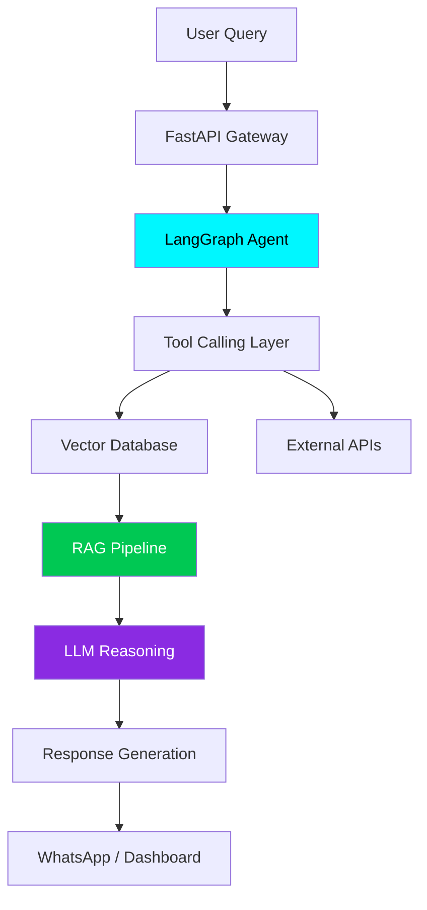

<div align="center">

# ⚡ AANISH DESHMUKH ⚡


</div>

---

<div align="center">

### 🧠 AI Engineer • 🔐 Security Researcher • ⚡ Agentic Systems Builder

</div>

---

# 🚀 About Me

```bash
> whoami

Aanish Deshmukh
B.Tech CSE (IoT + Cybersecurity + Blockchain)

> current_focus

- Agentic AI Systems
- Multi-Agent Architectures
- LangGraph Workflows
- RAG Pipelines
- AI Security
- MCP Ecosystems
- AI Automation Infrastructure

> currently_building

- AI Multilingual Business Assistant
- WhatsApp AI Automation Systems
- Browser-based RAG Applications
- AI + Cybersecurity Workflows

> philosophy

"Building autonomous systems that combine intelligence,
security, and real-world usefulness."
```

---

# ⚡ TECH STACK

<div align="center">

## 👨‍💻 Languages


---

## ⚡ Frontend & Backend


---

## 🧠 AI / ML / GenAI


---

## 🛢️ Database & DevOps


---

## 🔐 Cybersecurity


</div>

---

# 🧠 AI SYSTEM ARCHITECTURE

<div align="center">



</div>

---

# 🚀 FEATURED PROJECTS

---

## 🤖 AI Multilingual Business Assistant

### ⚡ Agentic AI + WhatsApp Automation Platform

- 🧠 LangGraph-based autonomous workflows
- 🌍 Multilingual conversation handling
- 🔎 RAG-powered business knowledge retrieval
- 📲 WhatsApp API integration
- 🛠️ Tool-calling AI agents
- 📊 Admin dashboard for management
- 🔐 Secure architecture

### Tech Used

```txt
FastAPI • LangChain • LangGraph • React • MongoDB
RAG • OpenAI APIs • WhatsApp API • Vector DB
```

---

## 🧠 MediumPilot

### Browser-based RAG Assistant for Medium Articles

- 📖 AI chatbot injected into Medium articles
- 🧠 Context-aware retrieval system
- 🔎 ChromaDB vector search
- ⚡ LangSmith monitoring
- 🌐 Browser Extension architecture

### Pipeline

```txt
HTML Loader → Text Splitter → ChromaDB →
Retriever → Augmentation → LLM Generation
```

---

## 🔐 Security Research & Pentesting

### Real-world vulnerability assessment experience

Worked on:

- XSS
- IDOR
- CSRF
- Rate Limiting
- Authentication flaws
- Security analysis

---

# 📊 GITHUB ANALYTICS

<div align="center">


</div>

---

<div align="center">


</div>

---

# 📈 CONTRIBUTION GRAPH

<div align="center">

[](https://github.com/ashutosh00710/github-readme-activity-graph)

</div>

---

# 🏆 ACHIEVEMENTS & CERTIFICATIONS

<div align="center">


</div>

---

# 🌐 CONNECT WITH ME

<div align="center">

<a href="https://linkedin.com/in/YOUR-LINKEDIN">
  
</a>

<a href="mailto:anishdeshmukh9@gmail.com">
  
</a>

<a href="https://github.com/anishdeshmukh9">
  
</a>

</div>

---

# 🐍 CONTRIBUTION SNAKE

<div align="center">


</div>

---

# ⚡ CURRENT INTERESTS

```txt
Agentic AI
AI Security
RAG Systems
A2A Communication
MCP Ecosystems
AI Infrastructure
LLMOps
MLSecOps
Autonomous Workflows
```

---

<div align="center">

## ⚡ “Building Intelligent Systems Beyond Simple Chatbots”


</div>
